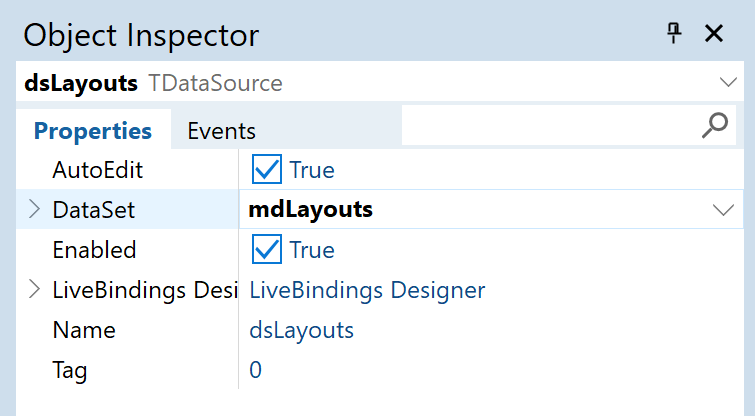

<!-- default badges list -->

[](https://supportcenter.devexpress.com/ticket/details/T1308581)
[](https://docs.devexpress.com/GeneralInformation/403183)
[](#does-this-example-address-your-development-requirementsobjectives)
<!-- default badges end -->

# DevExpress Reports for Delphi/C++Builder – Store Report Layouts in a Database

This example application stores [DevExpress report layouts][TdxReport.Layout] in a database.
The sample allows users to create new layouts, modify existing layouts using the built-in Report Designer,
and save changes to the data source.


## Prerequisites

[DevExpress Reports Prerequisites][req]

[req]: https://docs.devexpress.com/VCL/405773/ExpressCrossPlatformLibrary/vcl-backend/reports-dashboards-app-deployment#vcl-reportsdashboards-prerequisites


## Test the Example

1.  Run the sample app and click **New Report**.
1.  Click **Design Report** to display the [Report Designer][dx-report-designer] dialog.
    1.  Create a report layout using tools available within the UI.
    1.  Click the hamburger button, select the **Save** option, and close the dialog.
1.  Close and restart the app.
    Click **Design Report** or **Preview Report** to load the saved report in the
    [Report Designer][dx-report-designer] or [Viewer][dx-report-viewer].

## Implementation Details

The example uses a DevExpress memory-based dataset for report layout storage: [TdxMemData].
You can modify the application to use any other [TDataSet] descendant instead.
To review our data module implementation, see the following file: [uData.pas]/[uData.cpp].

The instructions assume that you start with a Delphi or C++Builder project that already includes
a configured data source for DevExpress Reports.
To configure a report data source in your project, refer to the following tutorial:
[Create a Table Report Using the Report Wizard][report-wizard].
This example project uses a SQLite sample database ([nwind.db]) as the report's data source.

### Step 1: Create a Dataset to Store Report Layout Data

1.  Add a [TdxMemData] component to the data module (`mdLayouts` in the example).
1.  Add a [TDataSource] component to the data module (`dsLayouts` in the example). 
    Assign the previously created dataset component to `TDataSource.DataSet`:

    > 

1.  Open the context menu for the dataset component and select **Field Editor…**:
    
    > 

1.  Click **Add…** to create a BLOB field for layout data:

    > 

1.  Click **Add…** to create a string field for layout names:

    > 

1.  (*Optional*) Preload persistent data to the dataset to make layouts available in the application upon first launch.

    This example includes a sample report layout that displays data from the Northwind sample database.
    You can preload it from [example.dat].
    Open the context menu for the dataset component, select **Persistent Editor…**, click **Load…**, and select the file.
    
    > 

    Alternatively, you can use the Report Designer later to import report data from a file.


### Step 2: Load a Report Layout Definition

To load a layout definition to the [TdxReport] component, you must specify
report name ([TdxReport.ReportName]) and layout ([TdxReport.Layout]):

```pas
procedure TMainForm.LoadReportNameAndLayout();
begin
  // Ensure that the dataset has at least one record or a new record is being created:
  if (DataModule1.mdLayouts.RecordCount = 0) and not (DataModule1.mdLayouts.State = dsInsert) then
  begin
    ShowMessage('The database is empty');
    Exit;
  end;
  // Load report name and layout from the database:
  dxReport1.ReportName := DataModule1.mdLayoutsName.AsString;
  dxReport1.Layout.Assign(DataModule1.mdLayoutsLayout);
end;
```

To load a different report, assign a new report name and layout.
The assigned report replaces the current layout definition.


### Step 3: Display Report Designer and Viewer

Once you assigned a name and layout to the [TdxReport] component,
you can display [Report Designer][dx-report-designer] and [Report Viewer][dx-report-viewer] dialogs:

```pas
procedure TMainForm.btnDesignClick(Sender: TObject);
begin
  LoadReportFromLayout; // Loads a report layout definition from the database
  dxReport1.ShowDesigner; // Displays the Report Designer
end;

procedure TMainForm.btnPreviewClick(Sender: TObject);
begin
  LoadReportFromLayout; // Loads a report layout definition from the database
  dxReport1.ShowViewer; // Displays the Report Viewer
end;
```


### Step 4: Store Report Layouts in a Dataset

When a user edits and saves a report in the Report Designer,
the value of [TdxReport.Layout] changes and an [OnLayoutChanged] event is called.
Handle this event to save layout changes to the active dataset record.

```pas
procedure TMainForm.dxReport1LayoutChanged(ASender: TdxReport);
begin
  // Start editing the active dataset record:
  DataModule1.mdLayouts.Edit;

  // Save report name and layout to the database:
  DataModule1.mdLayoutsName.AsString := dxReport1.ReportName;
  DataModule1.mdLayoutsLayout.Assign(dxReport1.Layout);

  // Finish editing and post the modified record to the database:
  DataModule1.mdLayouts.Post;
end;
```


### Step 5: Persist Data between Application Sessions

This step is applicable only to the memory-based [TdxMemData] datasource.

To save the dataset to a file and restore data on app restart,
handle `OnCreate` and `OnDestroy` events of the data module:

```pas
const
  DataFileName = 'data.dat';

procedure TDataModule1.DataModuleCreate(Sender: TObject);
begin
  if FileExists(DataFileName) then
    mdLayouts.LoadFromBinaryFile(DataFileName)
end;

procedure TDataModule1.DataModuleDestroy(Sender: TObject);
begin
  if mdLayouts.RecordCount > 0 then
    mdLayouts.SaveToBinaryFile(DataFileName)
end;
```


## Files to Review

-   [uData.pas]/[uData.cpp] stores report layouts.
-   [uMainForm.pas]/[uMainForm.cpp] creates a [TdxReport], loads report layouts from the data module, and displays Report Designer/Viewer.
-   [data.dat] stores the memory-based dataset state between application sessions.
-   [nwind.db] contains the Northwind sample database used as a data source for report content.


## Documentation

-   [Introduction to VCL Reports][reports-intro]
-   [Tutorial: Create a table report using the Report Wizard][report-wizard]
-   [Use SQLite as a data source for reports (as demonstrated in the current example)][sqlite-data-source]
-   [Store report layouts in REPX files at design-time][reports-design-time-store]
-   API reference:
    -   [TdxReport.ReportName] (internal report name that is not included in the layout)
    -   [TdxReport.Layout] (an XML-based layout template that can be stored in a BLOB data field)
    -   [TdxMemData] (DevExpress in-memory dataset implementation)
    -   [TDataSet] (contains generic database connection methods)
    -   [TdxBackendDatabaseSQLConnection] (supplies data to reports)

<!-- documentation links -->
[reports-intro]: https://docs.devexpress.com/VCL/405469/ExpressReports/vcl-reports
[report-wizard]: https://docs.devexpress.com/VCL/405760/ExpressReports/getting-started/create-table-report-using-report-wizard
[sqlite-data-source]: https://docs.devexpress.com/VCL/405750/ExpressCrossPlatformLibrary/vcl-backend/database-engines/vcl-backend-sqlite-support
[reports-design-time-store]: https://docs.devexpress.com/VCL/dxReport.TdxReport.Layout#string-list-editor
[dx-report-viewer]: https://docs.devexpress.com/XtraReports/401850/web-reporting/web-document-viewer
[dx-report-designer]: https://docs.devexpress.com/XtraReports/119176/web-reporting/web-end-user-report-designer


<!-- reference links -->
[TdxReport]: https://docs.devexpress.com/VCL/dxReport.TdxReport
[TdxReport.Layout]: https://docs.devexpress.com/VCL/dxReport.TdxReport.Layout
[TdxReport.ReportName]: https://docs.devexpress.com/VCL/dxReport.TdxReport.ReportName
[TdxReport.ShowDesigner]: https://docs.devexpress.com/VCL/dxReport.TdxReport.ShowDesigner
[TdxReport.ShowViewer]: https://docs.devexpress.com/VCL/dxReport.TdxReport.ShowViewer
[TdxBackendDatabaseSQLConnection]: https://docs.devexpress.com/VCL/dxBackend.ConnectionString.SQL.TdxBackendDatabaseSQLConnection
[TdxMemData]: https://docs.devexpress.com/VCL/dxmdaset.TdxMemData
[OnLayoutChanged]: https://docs.devexpress.com/VCL/dxReport.TdxReport.OnLayoutChanged

<!-- external documentation links -->
[TDataSet]: https://docwiki.embarcadero.com/Libraries/Athens/en/Data.DB.TDataSet
[TDataSource]: https://docwiki.embarcadero.com/Libraries/Athens/en/Data.DB.TDataSource
[ftString]: https://docwiki.embarcadero.com/Libraries/Athens/en/Data.DB.TFieldType
[ftWideString]: https://docwiki.embarcadero.com/Libraries/Athens/en/Data.DB.TFieldType
[ftBlob]: https://docwiki.embarcadero.com/Libraries/Athens/en/Data.DB.TFieldType

<!-- in-repository links -->
[uData.pas]: ./Delphi/uData.pas
[uData.cpp]: ./CPB/uData.cpp
[data.dat]: ./Delphi/data.dat
[example.dat]: ./Delphi/example.dat
[uMainForm.pas]: ./Delphi/uMainForm.pas
[uMainForm.cpp]: ./CPB/uMainForm.cpp
[nwind.db]: ./Delphi/nwind.db


## More Examples

-   [Store report layouts in REPX files][file-example]

[file-example]: https://github.com/DevExpress-Examples/vcl-reports-store-layout-template-file


<!-- feedback -->
## Does This Example Address Your Development Requirements/Objectives?

[](https://www.devexpress.com/support/examples/survey.xml?utm_source=github&utm_campaign=vcl-reports-store-layout-template-database&~~~was_helpful=yes) [](https://www.devexpress.com/support/examples/survey.xml?utm_source=github&utm_campaign=vcl-reports-store-layout-template-database&~~~was_helpful=no)

(you will be redirected to DevExpress.com to submit your response)
<!-- feedback end -->

